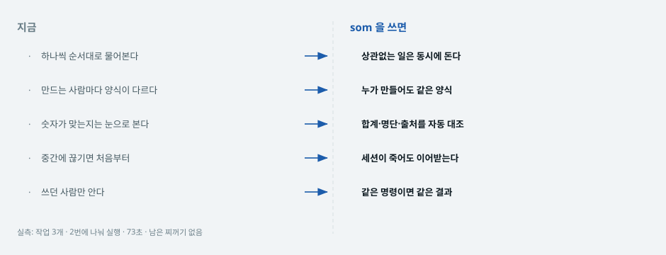
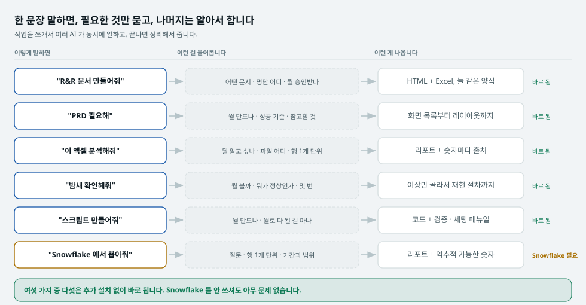
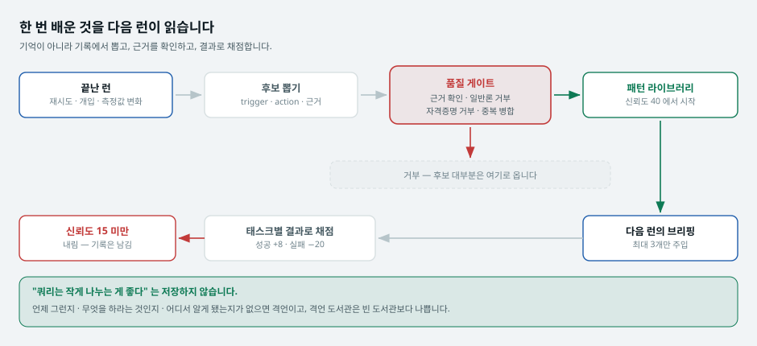
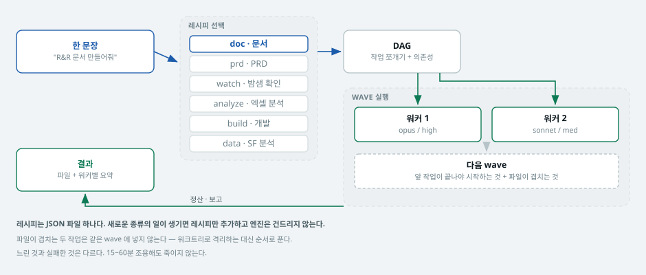
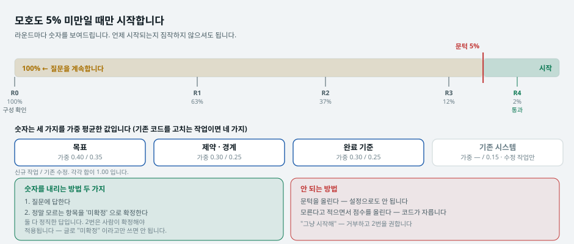
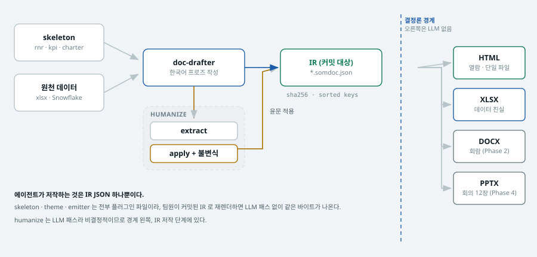
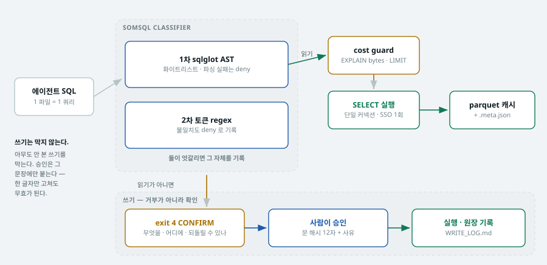
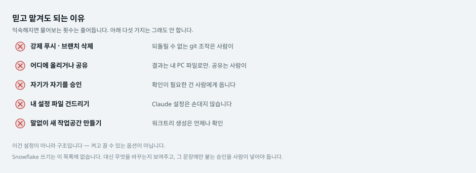
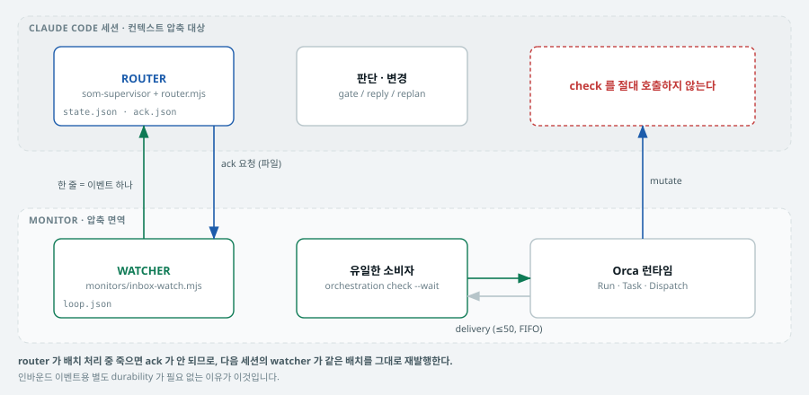
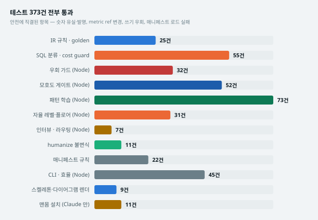

# som

**말로 시키면, 모를 때는 물어보고, 만들어서, 검증까지 하는 Claude Code 플러그인.**

SOM 유닛의 반복 업무 — 팀 문서 · PRD · 엑셀 분석 · Snowflake 분석 · 내부 도구 ·
밤샘 검증 — 을 매번 같은 품질로 뽑기 위해 만들었습니다.

```
/plugin marketplace add KyeongJe/som-claude-plugin
/plugin install som@som-marketplace
```

**설치하면 끝입니다.** Claude Code 외에 필요한 것이 없습니다. Python 추가 패키지도,
Orca 도 없이 **여섯 가지 업무 중 다섯이 그대로 돕니다.** 나머지 하나만 Snowflake
계정이 필요합니다.

---

## 1. 이런 게 반복되면 필요합니다

<picture>
  <source media="(prefers-color-scheme: dark)" srcset="som/docs/img/before-after-dark.svg">
  
</picture>

| 겪는 일 | som 이 하는 일 |
|---|---|
| **문서 양식이 매번 다르다.** 사람마다 다르고, 같은 사람도 지난번과 다르다 | 뼈대·색·표·차트가 전부 플러그인 파일이다. 누가 만들어도 같은 양식이 나온다 |
| **숫자를 어디서 가져왔는지 나중에 못 찾는다** | 모든 수치가 지표 키를 참조한다. 산식과 원천이 문서에 같이 실린다 |
| **"알아서 해줘" 했더니 없는 사람 이름이 들어가 있다** | 모르면 지어내지 않고 **멈추고 묻습니다.** 이게 첫 번째 규칙입니다 |
| **한 번 배운 걸 다음 사람이 또 배운다** | 이번에 알게 된 것을 근거와 함께 저장하고, 다음 런이 자동으로 읽습니다 |
| **밤새 확인해야 하는 일을 사람이 지킨다** | 반복 검증을 걸어놓고 자면, 아침에 라운드별 관측과 이상 건 재현 절차가 있습니다 |
| **Snowflake 에서 실수로 쓰기를 할까 무섭다** | 쓰기 전에 **무엇을 어디에 하는지 문장으로 보여주고 멈춥니다.** 그 문장에만 붙는 승인 코드를 사람이 넣어야 돕니다 |

## 2. 여섯 가지 일

<picture>
  <source media="(prefers-color-scheme: dark)" srcset="som/docs/img/what-you-get-dark.svg">
  
</picture>

**슬래시 명령을 외울 필요가 없습니다.** 하고 싶은 일을 말하면 스킬이 알아서 붙습니다.

| 이렇게 말하면 | 물어보는 것 | 나오는 것 | 필요한 것 |
|---|---|---|---|
| "**R&R 문서** 만들어줘"<br>"KPI 대장" · "팀 차터" | 문서 유형 · 명단 원천 · 승인받을 사항 · 독자 | 단일 HTML + xlsx + 검증 리포트 | Claude 만 |
| 이 **엑셀** 분석해줘 | 답할 질문 · 파일 · 행 단위 · 범위 | 리포트 + 역추적 가능한 숫자 | Claude 만 |
| 밤새 **확인**해줘 | 대상 · 정상 기준 · 횟수 · 간격 | 라운드별 관측 + 이상 건 재현 절차 | Claude 만 |
| **Snowflake** 에서 뽑아줘 | 답할 질문 · 행 단위 · 범위 | 리포트 + 역추적 가능한 숫자 | + Snowflake 계정 |
| **PRD** 필요해 | 제품 · 성공 기준 · 기존 자산 | 화면별 레이아웃까지 담긴 PRD | Claude 만<br><sub>Orca 있으면 1단계 단축</sub> |
| **만들어**줘 (내부 도구) | 대상 · 완료 조건 · 기존 코드 | 코드 + 검증·세팅 매뉴얼 | Claude 만<br><sub>Orca 있으면 1단계 단축</sub> |

원천을 안 밝히고 "매출 분석해줘" 라고 하면 **엑셀 쪽으로 갑니다** — 그리고 첫 질문이
데이터가 어디 있는지입니다. Snowflake 라고 답하면 그때 바꿉니다. 반대로 하면 없는
계정을 전제로 시작해서 두 번 묻게 됩니다.

**새로운 종류의 일이 생기면 레시피 JSON 하나만 추가합니다.** 엔진은 건드리지 않습니다
— `som/skills/conduct/recipes/`

## 3. 왜 팀이 같이 쓰면 좋은가

### ① 같은 입력이면 누구 머신에서든 같은 파일이 나옵니다

에이전트가 만드는 것은 JSON 하나뿐이고, HTML·xlsx 는 플러그인 안의 렌더러가 만듭니다.
그래서 그 JSON 만 공유하면 다른 사람이 **바이트까지 같은 문서**를 다시 뽑습니다.
매 빌드가 이걸 검사합니다.

### ② 배운 게 개인이 아니라 팀에 남습니다

<picture>
  <source media="(prefers-color-scheme: dark)" srcset="som/docs/img/learning-loop-dark.svg">
  
</picture>

**런이 끝나면 엔진이 직접 기록합니다.** 선언한 범위 밖 파일을 고친 노드, 두 번
넘게 재시도한 노드, 사람이 풀어줘야 진행된 노드 — 전부 엔진이 **실제로 관측한**
것이고, 노드 이름과 실제 경로가 채워진 문장으로 남습니다.

`/som:learn` 으로 직접 적어 넣을 수도 있습니다. 어느 쪽이든 게이트는 같습니다 —
근거 없는 격언, 없는 파일을 가리키는 근거, 자격증명이 섞인 패턴은 **저장 단계에서
거부**됩니다. 맞은 패턴은 신뢰도가 오르고 빗나간 패턴은 내려갑니다.

엔진이 스스로 적은 것은 **신뢰도 25 에서 시작**합니다(사람이 적은 것은 40). 한 번
본 것과 사람이 "이건 교훈이다" 라고 판단한 것은 무게가 달라야 하고, 스킬로 승격되려면
평균 70 이 필요하니 자동 관측은 **여섯 번쯤 맞아야** 승격 후보가 됩니다.

### ②-b 쓸수록 나한테 맞춰집니다 — 스스로 스킬을 만듭니다

패턴 하나는 관찰이고, **반복해서 증명된 패턴 묶음은 일하는 방식**입니다. 그런 묶음은
`~/.claude/skills/som-*/SKILL.md` 로 **승격**됩니다 — Claude 가 묻지 않고 읽는
자리라서, som 을 쓰지 않는 평범한 대화에서도 그대로 적용됩니다.

```bash
som learn skills plan            # 뭐가 승격 가능한지, 나머지는 왜 보류인지. 아무것도 안 씀
som learn skills promote --yes   # 확인한 다음에만
```

승격은 **얻어내는 것**이지 쌓인다고 되는 게 아닙니다 — 관련 패턴 3건 이상, 평균
신뢰도 70 이상, 실제 적용 6회 이상, 전원이 한 번은 맞았을 것. 전부 산술이라
판단이 끼어들지 않고, 보류된 묶음은 **사유가 같이 나옵니다.**

- **상한 8개.** 스킬 설명문은 모든 대화에서 항상 읽힙니다. 늘리는 대신 안 쓰는 걸 내립니다
- **이름은 항상 `som-`.** 직접 만드신 스킬을 가릴 수 없습니다
- **`som-generated: true` 표식이 없으면 안 건드립니다.** 이름이 같아도 그대로 두고 보고만 합니다
- **되돌리기는 폴더 삭제.** 생성된 파일은 출처 패턴 id 와 적용 횟수를 본문에 싣고,
  "안 맞으면 따르지 말고 말해 달라"로 끝납니다

### ③ 물어보는 기준이 사람마다 다르지 않습니다

요청이 얼마나 모호한지 숫자로 계산하고, **5% 미만이 되기 전에는 시작하지 않습니다.**
"대충 알아서" 로 시작해서 세 번 다시 만드는 일이 없어집니다.

### ④ 위험한 것은 레벨과 무관하게 막혀 있습니다

산출물 자동 발행 · 설정 파일 편집 · force push · `orchestration reset` ·
자기 게이트 자기 해제 · 새 워크트리 — 이 여섯 가지는 **어떤 자율 레벨에서도,
사람이 "예" 라고 해도** 통과하지 않습니다. 사람이 직접 가서 해야 합니다.

Snowflake 쓰기는 여기 없습니다. 테이블을 만들어야 할 때가 실제로 있기 때문입니다.
대신 **어느 레벨에서도 자동이 되지 않습니다** — 무엇을 바꾸는지 보여주고, 그 문장에만
붙는 승인을 사람이 넣어야 돕니다.

### ⑤ 팀원에게 보여줄 페이지가 이미 있습니다

`som/docs/som-team-intro.html` — 브라우저로 그냥 열립니다. 외부 요청 0, 첨부 없음,
그림 중심 5분. **그 페이지 자체가 som 이 만든 문서입니다.**

## 4. 어떻게 도는가

<picture>
  <source media="(prefers-color-scheme: dark)" srcset="som/docs/img/how-it-works-dark.svg">
  
</picture>

다섯 단계가 전부입니다. **INTAKE → BLUEPRINT → EXECUTE → ATTEST → DELIVER.**

각 경계는 산문이 아니라 **코드가 판정하는 게이트**입니다. 필수 항목이 비어 있거나,
모호도가 5% 이상이거나, 숫자가 원천과 안 맞으면 다음 단계로 넘어가지 않습니다.

### 모호도 게이트 — 지어내지 않게 만드는 장치

<picture>
  <source media="(prefers-color-scheme: dark)" srcset="som/docs/img/ambiguity-gate-dark.svg">
  
</picture>

요청을 **목표 · 제약 · 완료 조건** 세 차원으로 채점합니다. 기존 시스템을 건드리는
일이면 **파악도** 가 추가됩니다. 라운드마다 지금 숫자와 문턱을 같이 보여주므로
"왜 아직 시작 안 하지" 가 생기지 않습니다.

- **이미 말한 것은 다시 묻지 않습니다.** 첫 문장에서 답이 나온 차원은 그 문장을
  근거로 먼저 채점합니다. 완전히 명시된 요청은 **라운드 1회**로 열립니다
- **모르는 채로 갈 수도 있습니다.** "이건 나중에 정할게요" 를 정식으로 기록하면
  게이트가 열립니다 — 다만 산출물에 미확정으로 남습니다
- **문턱은 상한입니다.** 설정으로 더 조일 수는 있고 느슨하게는 못 합니다

### 문서 표준 — 하나의 JSON, 여러 형식

<picture>
  <source media="(prefers-color-scheme: dark)" srcset="som/docs/img/somdoc-pipeline-dark.svg">
  
</picture>

**에이전트는 HTML 을 쓰지 않습니다.** JSON 하나만 채우고, 렌더링은 플러그인 안의
결정론적 엔진이 합니다. 이게 "같은 산출물" 을 약속이 아니라 구조로 만듭니다.

블록 13종(표 · 차트 · 매트릭스 · 히트그리드 · KPI 타일 · 결정 요청 · 리스크 ·
변경이력 · 원천 부록 …), 차트 5종(`bar` `hbar` `line` `dot-strip` `heat-grid`).
**파이 차트는 없습니다 — 의도적입니다.**

실무에서 가장 자주 사고를 막는 규칙 셋:

- **행 단위 명시** — "행 1개 = 팀원 1명". 표의 행 단위를 안 적으면 렌더가 거부합니다.
  경영진이 표를 잘못 읽는 1순위 원인입니다
- **차트마다 결론 한 줄** — 굵게, **차트 위에** 붙습니다. 결론을 산문에 묻어두지
  못하게 렌더러가 강제합니다
- **결정 요청** — 무엇을 승인받으려는지가 앞 3개 절 안에, 3건 이내로. 없으면 문서가
  만들어지지 않습니다. 그리고 **지어내지 않습니다**

### Snowflake — 읽기는 자동, 쓰기는 보여주고 승인받고

<picture>
  <source media="(prefers-color-scheme: dark)" srcset="som/docs/img/snowflake-guard-dark.svg">
  
</picture>

`SELECT` · `WITH` · `SHOW` · `DESCRIBE` 는 그냥 돕니다.

- **게이트 두 개** — SQL 파서(허용 목록 방식)와 토큰 스캔. 둘 중 하나라도 거부하면
  거부입니다. 둘이 엇갈리면 그 자체를 기록합니다 — 하나가 틀렸고 사람이 알아야 합니다
- **`WITH x AS (...) INSERT INTO t`** 처럼 앞부분만 읽기인 SQL 도 잡습니다
- **읽기에는 상한이 없습니다.** 필요한 만큼 가져옵니다. 바이트·행·시간 제한을
  두지 않고, LIMIT 을 몰래 끼워 넣지도 않습니다 — 1,000행으로 잘린 결과는 완전한
  결과와 똑같이 생겼습니다
- **대신 뭘 하는지 먼저 말해 줍니다.** 카티전 조인, 날짜 조건 없는 대형 테이블 조회,
  EXPLAIN 스캔 견적을 **크레딧 0으로** 알려주고, 그대로 실행합니다. 24시간 결과
  캐시도 있습니다 (같은 질문을 두 번 안 돌립니다)
- **모든 시도가 원장에 남습니다.** 거부된 것도요 — 흔적 없는 거부는 다음번에 우회됩니다
- **이 저장소에는 실제 테이블 이름이 없습니다.** 우리 쪽 객체 목록은 쿼리를 돌리는
  컴퓨터의 `.som/registry.json` 에 둡니다. 비어 있으면 `/som:doctor` 와 `somsql plan`
  이 "이 가드는 지금 동작하지 않는다"고 알려줍니다 — 조용히 약해지지 않습니다

읽기가 아닌 것은 **거부하지 않고, 멈춰서 보여줍니다.** 테이블을 만들고 값을 고치고
쓰다 버린 객체를 지우는 것은 실제 업무입니다. 막아야 하는 건 쓰기가 아니라
**아무도 안 본 쓰기** 입니다.

```
SOMSQL-CONFIRM  읽기가 아닙니다. 진행하려면 확인이 필요합니다.
작업     : DELETE — 행을 지웁니다
대상     : ANALYTICS.PUBLIC.VISIT_GAP
되돌리기 : Time Travel 로 복구 가능합니다
주의     : WHERE 절이 없습니다 — 대상 테이블의 **모든 행**에 적용됩니다.
문 해시  : 1479c4ba168e
```

- **승인은 그 문장에만 붙습니다.** 12자리는 SQL 자체의 해시입니다. 한 글자만 고쳐도
  해시가 달라져 승인이 무효가 됩니다 — 한 건에 준 "예" 가 다른 건으로 옮겨가지 않습니다
- **사유가 없으면 안 돕니다.** `--reason` 은 접속을 열기 **전에** 검사합니다.
  반년 뒤에 이 변경을 설명하는 건 그 한 줄입니다
- **모델은 승인 코드를 채울 수 없습니다.** 해시는 터미널에서 사람에게 갔다가
  사람에게서 돌아옵니다
- **기존 스크립트는 막지 않습니다.** 이 플러그인이 생기기 전부터 팀이 쓰던
  Snowflake 스크립트는 **경고만 하고 그대로 돕니다.** som 을 깐다고 som 과 무관한
  업무가 멈추면 안 됩니다

### 자율 레벨 — 그리고 절대 안 되는 것

<picture>
  <source media="(prefers-color-scheme: dark)" srcset="som/docs/img/guardrails-dark.svg">
  
</picture>

성공 이력이 쌓이면 물어보는 횟수가 줄어듭니다. **바닥은 안 움직입니다.**

<!-- AUTONOMY-TABLE: test/autonomy.test.mjs 가 이 표를 파싱해 decide() 와 칸마다 대조합니다. 손으로 고치면 테스트가 깨집니다. -->

| 동작 | L0 | L1 | L2 | L3 | L4 |
|---|---|---|---|---|---|
| `worker.start` 워커 띄우기 | 확인 | 확인 | 자동 | 자동 | 자동 |
| `answer.question` 스펙 안의 질문 | 확인 | 확인 | 자동 | 자동 | 자동 |
| `answer.scope-change` 범위가 바뀌는 질문 | 확인 | 확인 | 확인 | 자동 | 자동 |
| `write.in-scope` 선언한 글롭 안 쓰기 | 확인 | 자동 | 자동 | 자동 | 자동 |
| `write.out-of-scope` 글롭 밖 쓰기 | **거부** | 확인 | 확인 | 확인 | 확인 |
| `worker.stop` 워커 강제 종료 | 확인 | 확인 | 확인 | 자동 | 자동 |
| `worktree.create` 새 워크트리 | **거부** | **거부** | **거부** | **거부** | **거부** |

동시 워커: L0 1 · L1 2 · L2 3 · L3 4 · L4 4

어떤 레벨로도, 사람이 "예" 라고 해도 **안 되는 것**:

<!-- HARD-FLOORS: test/floors.test.mjs 가 이 목록을 파싱해 HARD_FLOORS 와 대조합니다. 손으로 고치면 테스트가 깨집니다. -->

| 동작 | 무엇 |
|---|---|
| `orchestration.reset` | 진행 중인 조율 상태 파괴 |
| `git.force-push` | force push · 브랜치 삭제 · dirty 트리 `reset --hard` |
| `publish` | artifact 발행 · 공유 폴더 자동 복사 |
| `edit.user-config` | `~/.claude/settings.json` · `CLAUDE.md` · 플러그인 설정 편집 |
| `gate.self-resolve` | 자기가 만든 게이트를 자기가 해제 |
| `worktree.create` | 새 워크트리 생성 |

<!-- /HARD-FLOORS -->

**Snowflake 쓰기는 이 목록에 없습니다.** 예전에는 있었고, 근거는 "사람의 예를
쓰기로 바꾸는 코드 경로가 아예 없다" 였습니다. 테이블을 만들어야 하는 날 그 근거가
깨졌습니다. 지금은 **어느 레벨에서도 자동이 되지 않는 게이트** 입니다 — 거부도 아니고
자동도 아닌, 항상 물어보는 자리.

게이트는 엔진이 **물어볼 수 있는** 예/아니오이고, 하드플로어는 사람이 **직접 가서
해야 하는** 것입니다. 이 비대칭이 설계의 전부입니다.

**이 표는 코드가 실제로 하는 일입니다.** `test/autonomy.test.mjs` 가 이 README 의
표를 직접 파싱해 판정 함수와 칸마다 대조하고, `test/floors.test.mjs` 가 위 목록을
파싱해 코드의 플로어 목록과 대조한 뒤, 플로어마다 **어디서 막히는지**(판정 호출 ·
별도 가드 · 그런 코드가 아예 없음)를 선언하게 하고 그 선언이 사실인지 코드에서
확인합니다.

## 5. Orca 가 있으면 — 없어도 됩니다

여섯 중 넷은 단계가 **전부 순차**입니다. 동시에 도는 작업이 없으니 워커를 띄워도
얻는 게 없고, 대신 런 생성·워커 기동·정산·대기를 단계 수만큼 치릅니다.
**그래서 순차 계획이면 Orca 를 확인조차 하지 않고** 한 세션에서 순서대로 진행합니다.

`prd` 와 `build` 만 동시에 도는 구간이 있고, 거기서 Orca 가 줄이는 것은 **한 단계**
입니다. 그 한 단계를 위해 Orca 를 깔 이유는 없습니다.

### 그래도 받고 싶다면

**받는 곳:** https://github.com/stablyai/orca/releases

Windows 는 `.exe` 설치본을 받아 실행하면 끝입니다. 설치 후 터미널에서 확인:

```bash
orca --version
```

som 은 **Orca 가 있으면 알아서 씁니다.** 설정할 것도, 켤 것도 없습니다.
없으면 없는 대로 순차로 돌고, `/som:doctor` 가 어느 쪽인지 알려줍니다.

<picture>
  <source media="(prefers-color-scheme: dark)" srcset="som/docs/img/coordinator-loop-dark.svg">
  
</picture>

Orca 를 쓸 때는 이 플러그인이 **스케줄링을 직접 합니다** — Orca 는 하지 않습니다.
같은 파일을 건드리는 작업은 같은 wave 에 넣지 않고, 정산이 끝나기 전에는 터미널을
놓지 않으며, 같은 메시지가 다시 와도 부수효과는 한 번만 일어납니다.

## 6. 검증된 것

<picture>
  <source media="(prefers-color-scheme: dark)" srcset="som/docs/img/graph-tests-dark.svg">
  
</picture>

| 주장 | 어떻게 확인했나 | 결과 |
|---|---|---|
| Claude 외에 아무것도 없어도 문서가 나온다 | 선택 패키지 전부 ImportError · Orca 없음 | 골든과 바이트 동일 · 외부 요청 0 |
| 같은 입력이면 같은 파일이 나온다 | 동일 JSON 2회 빌드 바이트 비교 | 동일 |
| 뼈대 3종이 실제로 문서가 된다 | R&R · KPI · 차터 각각 렌더 | 해시 일치 · 재렌더 바이트 동일 |
| 오케스트레이션이 실제로 돈다 | 실제 Claude 워커로 e2e 2종 | 검사 27지점 통과 · 터미널 누수 0 |
| 모호한 채로 시작되지 않는다 | 점수 부풀리기 · 설정 완화 · 손편집 등 15종 공격 | 전부 거부 |
| 근거 없는 교훈이 안 쌓인다 | 격언 · 없는 파일 · 자격증명 · 캐치올 등 12종 | 전부 거부 |
| 하드플로어가 안 열린다 | L0~L4 × 점수 0/50/100 × 플로어 6종 + 원장 손편집 | 전부 거부 |
| 쓰기가 아무도 모르게 안 돈다 | 승인 없음 · 다른 문장의 승인 · 승인 후 수정 · 사유 없음 | 전부 정지, 전송 0 |
| 우회로 Snowflake 에 못 닿는다 | 주석 은닉 · 체이닝 · 치환 등 21종 | 전부 거부 |
| 가드가 오탐을 안 낸다 | `grep -r SELECT` · `pip install` · 커밋 메시지 등 | 전부 통과 |
| 발행된 자율 표가 코드와 같다 | 이 README 의 표를 파싱해 판정 함수와 대조 | 일치 |
| 발행된 숫자가 실측과 같다 | 전 스위트 실행 후 세 곳 대조 | 일치 |
| 검증기가 나쁜 입력에 안 죽는다 | 잘못된 형태 21종 | 크래시 0 · 전부 문장으로 보고 |

```bash
node --test test/*.test.mjs                       # 240   (18개 파일)
python engine/tests/test_write_path.py  # 28
python engine/tests/test_ir.py          # 25
python engine/tests/test_docx.py        # 10
python engine/tests/test_somsql.py      # 27
python engine/tests/test_manifest.py    # 22
python engine/tests/test_humanize_io.py # 11
python engine/tests/test_skeletons.py   #  6
python engine/tests/test_diagrams.py    #  3
python engine/tests/test_bare_install.py #  6
python engine/tests/test_bare_walkthrough.py # 5   합계 383
python docs/check_counts.py                       # 위 숫자가 실측과 같은지
node test/e2e-orca.mjs                            # 실제 워커 (유료)
node test/e2e-conduct.mjs                         # 실제 워커 (유료)
```

## 7. 부르는 법

**대부분은 그냥 말하면 됩니다.** 스킬이 작업 이름을 듣고 붙습니다 — "R&R 문서",
"KPI 대장", "팀 차터", "PRD", "화면 구성", "엑셀 분석", "밤새 확인", "자동화 스크립트".

명령으로 직접 부를 수도 있습니다.

| 명령 | 하는 일 |
|---|---|
| `/som:som` | 하고 싶은 일을 말하면 레시피를 골라 진행 |
| `/som:doc` | 팀 운영 문서 (R&R · KPI · 팀 차터) |
| `/som:interview` | 요청을 5% 미만까지 좁히는 심층 인터뷰 |
| `/som:learn` | 이번에 알게 된 것을 다음 런이 읽게 저장 |
| `/som:sql` | Snowflake 읽기 · 쓰기 (쓰기는 승인 필요) |
| `/som:doctor` | 환경 점검 — 22개 항목 |

**처음이면 `/som:doctor` 부터** 치세요. 지금 쓸 수 있는 것과 아직 안 되는 것을
이유·설치 명령과 함께 알려줍니다.

## 8. 필요 환경

| | |
|---|---|
| **필수** | Claude Code. 그게 전부입니다 |
| 문서 · PRD · 엑셀 분석 · 밤샘 검증 | 추가 설치 없음 (Python 표준 라이브러리만) |
| xlsx 출력 | `openpyxl` — 없으면 HTML 만 나오고 그 사실을 알려줍니다 |
| Snowflake 분석 | 계정 + 커넥터 + `sqlglot` |
| 동시 실행 (`prd` · `build` 에서 1단계 단축) | Orca CLI — [받는 곳](https://github.com/stablyai/orca/releases) |
| 한국어 윤문 | `humanize-korean` 플러그인 (없으면 건너뜁니다) |

없는 것은 **조용히 실패하지 않습니다.** `/som:doctor` 가 항목마다 "지금 쓸 수 있는
것 / 아직 안 되는 것" 을 설치 명령과 함께 보여줍니다.

## 9. 안 하는 것

- **산출물을 발행하지 않습니다.** 전부 로컬 파일입니다. 공유 폴더 복사도 사람이 합니다
- **Snowflake 에 쓰지 않습니다.** 기능이 꺼져 있는 게 아니라 코드 경로가 없습니다
- **모르는 것을 채우지 않습니다.** 이름도, 숫자도, 결정 요청도

## 경계

| 겹칠 수 있는 것 | 경계 |
|---|---|
| 다른 플러그인 | 다른 플러그인의 상태 폴더를 읽지도 쓰지도 않습니다. 같이 깔려 있어도 서로 간섭하지 않습니다 |
| Orca `orchestration` 스킬 | 그쪽이 CLI 문법의 권위. som 은 그 위에서 **무엇을 어떤 순서로** 할지를 정합니다 |
| `orca-cli` | 소유권 이양·터미널 제어는 그쪽. som 은 감독하며, 두 경로는 상호 배타적입니다 |

## 레이아웃

```
som/
├─ bin/som.mjs           단일 진입점 (interview · learn · conduct)
├─ skills/               conduct · doc-standard · interview · learn · snowflake-safe
│  └─ conduct/recipes/   레시피 6종 — 새 업무는 여기에 JSON 하나
├─ commands/             /som:* 6종
├─ lib/                  오케스트레이션 (Node, 의존성 0)
├─ engine/               문서 렌더러 · SQL 가드 (Python)
├─ standard/             뼈대 · 테마 · 스키마 · 예제 · doctor
├─ docs/                 팀 안내 페이지 · 다이어그램 (전부 생성됨)
└─ test/                 14개 파일
```

설계 결정과 벤치마크 비교: [`som/docs/DESIGN-NOTES.md`](som/docs/DESIGN-NOTES.md)

## 라이선스

MIT
